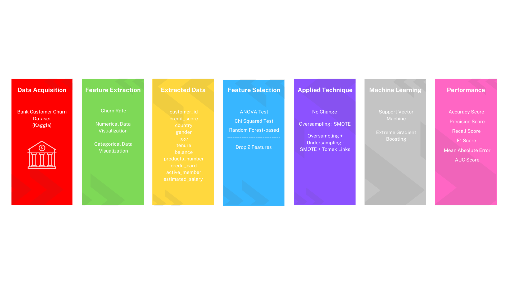

# Bank Customer Churn Prediction
A personal project to predict churn of bank customer from an open-source Kaggle dataset "Bank Customer Churn Dataset". This repository includes the dataset and the machine learning implementation, mainly focusing on the impact of feature selection and feature engineering, in this case involving Over-sampling and OverUnder-sampling training data on the performance of machine learning prediction. All of the steps to achieve this are listed in the provided graph below, and the intuitions are listed in the notebook.

